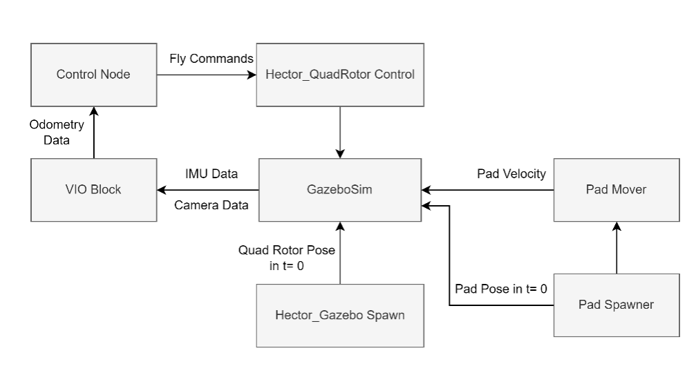

# Design and development of a visual inertial odometry system with moving target tracking approach for autonomous robots


Today, with the expansion of knowledge in various fields of science and technology, the field of robotics is developing day by day with the aim of increasing productivity and optimization. One of the most important goals of this field is to reduce or completely eliminate human intervention in carrying out processes; Because human intervention in many processes causes errors due to low accuracy, fatigue, etc. For this purpose, a new field called autonomous robots has been created with the aim of reducing or eliminating human intervention. Usually, the structure of the planning system of these robots consists of three main parts: map creation, localization and route design, and the robot needs an accurate odometry of its location for all three stages. In this way, odometry has a special importance in autonomous robots. This odometry can be done in different ways such as using GPS, laser scanner, lidar, single or stereo camera, etc. These methods all have many advantages, but some are not suitable for some robotic applications such as drones due to their high cost (lidar and laser scanner) and some due to low accuracy or calibration problems (GPS and camera). For this purpose, the visual-inertial odometry method is used, which is created by combining an inertial measurement sensor (IMU) and one or more cameras. In addition to being cheap and agile, this method has high flexibility for use in most robotic applications such as drones. In this research, the aim is to create a visual inertial odometry system based on the multi-state constraint Kalman filter (MSCKF) that can be used in the application of UAV landing on a moving platform. In this research, first the basic concepts required for the development of this algorithm such as sensor modeling, machine vision preliminaries, error-state Kalman filter are presented and then these concepts will be used to develop the related odometry method. At the end, this algorithm is implemented with the help of the famous OpenCV and Eigen libraries in the platform of the robot operating system (ROS) and it will be used in the application of the landing of the drone on the moving platform in the form of simulation. It should be mentioned that Gazebo simulator software is used for the application of UAV landing on the moving platform.

The Project Structure Presented Below:



The Requirements:

- ROS 1 (Melodic or Noetic)
- OpenCV 4+
- Egien 1.2+
- Gazebo 9+
- hector_quadrotor
- hector_localization
- hector_gazebo
- twist_mux
- twist_mux_msgs
- OpenVINS (ov_core, ov_eval)
- Bebop Simualtor

After install the requirements, use the below commands to run the program:

```bash

$ roslaunch landing_sim sim_env_startup.launch
$ roslaunch landing_sim flight_and_vio_startup.launch
$ rosrun landing_sim controller_node.py

```

See the video of how running the project in this link:
https://drive.google.com/file/d/133leQsLs7dtUpztwzZ6Fo3h-MzDwdNRT/view?usp=sharing

or watch on aparat:
https://www.aparat.com/v/WjMcN

<div id="56906083160"><script type="text/JavaScript" src="https://www.aparat.com/embed/WjMcN?data[rnddiv]=56906083160&data[responsive]=yes"></script></div>

If you are new to ROS, use the below fast hand-book to learn ROS:
https://github.com/ababayi/Beginners-tuts-on-ros1
